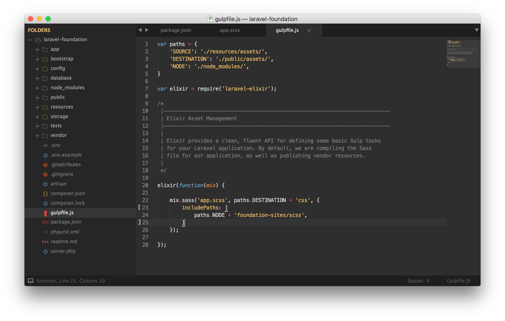
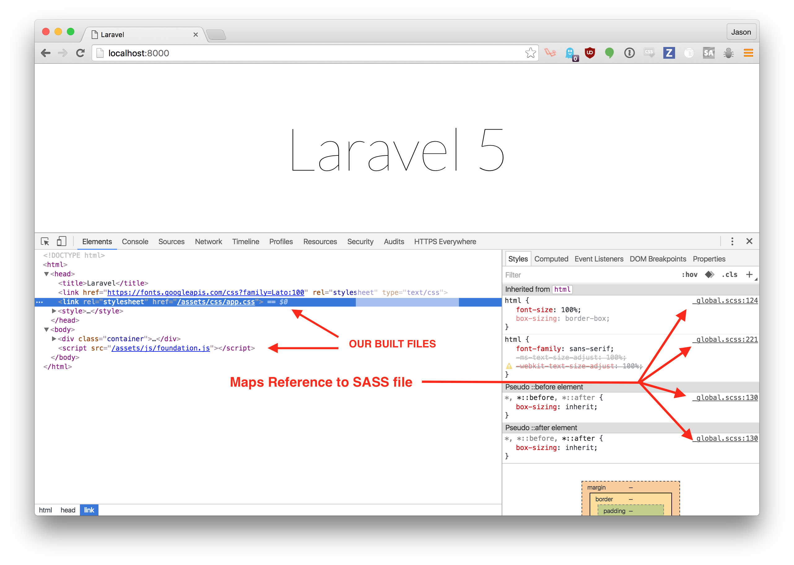

---
categories:
- software
- backend
- frontend
comments: true
date: "2016-05-05T00:00:00-07:00"
description: Laravel Elixir is a wrapper around a traditional Gulp build system that
  provides a clean, fluent API for defining basic Gulp Tasks.
images: 
- /covers/2016-05-05-setting-up-laravel-with-foundation.png
slug: setting-up-laravel-with-foundation
tags:
- php
- laravel
- foundation-sites
title: Setting Up Laravel Elixir with Foundation 6
---


[Laravel Elixir](https://laravel.com/docs/5.2/elixir) is a wrapper around a traditional Gulp build system that provides a clean, fluent API for defining basic Gulp Tasks. Although Laravel Elixir is branded with Laravel, it is truly a stand alone tool that can be used almost anywhere Gulp can. Laravel Elixir is a really powerful and useful tool and can make build systems that much easier for beginners. Let's see how we can use Zurb's Foundation for Sites 6 with Laravel Elixir so we can have a super minimal, yet powerfully flexible build system and Front End Framework.

### Setting Up Laravel

Lets go ahead and create a fresh install of Laravel. You are going to need [Composer](https://getcomposer.org/) to continue. You can go ahead and install Composer via Homebrew using:

```bash
$ brew install composer
```

If you need some help with Homebrew, see the Homebrew portion of my previous post, [Fresh Mac, Now What?](/posts/brew-install-everything).

Next, you are going to need to download the Laravel Installer. Check out the [Laravel Installation documentation](https://laravel.com/docs/5.2) if you need more detailed instructions on getting started.

```bash
$ composer global require "laravel/installer"
```

After that, we can go ahead and get a new project started.

```bash
$ cd ~/your/code/directory
$ laravel new laravel-foundation
$ cd laravel-foundation

```

### Installing Foundation & jQuery

The first thing we are going to want to do is install foundation and jQuery using node version manager (nvm). If you need help with nvm, check out [installing node version manager](http://blog.eventfarm.com/developers/fresh-mac-now-what-brew-install-everything#node-version-manager-nvm).

```bash
$ npm install --save foundation-sites jquery
```

We can go ahead and remove `"bootstrap-sass": "^3.3.0"` from our `package.json` file since we are going to be using Foundation instead of Bootstrap.

After we remove Bootstrap from our dependencies, we can install [Laravel Elixir](https://laravel.com/docs/5.2/elixir) to get started with building out our Foundation JS and CSS.

### Setting Up Laravel Elixir

Installing Laravel Elixir is super easy, especially considering it comes ready out of the box, only needing a simple `npm install` to get started. You can see "laravel-elixir" listed as a dependency under the devDependencies in your `package.json` file.


Since we have already run `npm install --save foundation-sites jquery `, we already have those dependencies installed in our `node_modules` folder. In order to install the rest of our node modules, we need to run an `npm install` in the root of our project directory.

This is going to actually install Laravel Elixir and Gulp into your projects `node_modules` directory.

### Foundation Sass

Getting Foundation's Sass imported is a breeze when using Laravel Elixir! The first thing we want to do is import the `scss` folder from the `foundation-sites`



What we are going to need to do is set up our `app.scss` file with the imports to Foundation using `@import 'foundation'`.

What this is doing is importing all of the Foundation mixins and makes them available for us to use. Effectively, if all you do is `@import 'foundation'`, you will not actually have any of the Foundation styles in your exported css file.

Foundation allows you to choose what pieces you want to import, and if you really dig into it, it allows you to create your own components that use the different Foundation mixins.

For this example, we are just going to go ahead and set up our `app.scss` file so it is ready to either import the entire Foundation library with `@include 'foundation-everything'`, or choose the pieces you would like to include.


### Foundation JavaScript

Foundation's JavaScript components use features of ECMAScript 2015, therefore in order to build the files ourselves, we are going to need to run them through a preprocessor such as Babel in order to compile our JS to ES5.


You would go ahead and initialize foundation just as usual with `$(document).foundation();` and that will kick off all Foundation elements at once.

### Building Foundation with Laravel Elixir

After your `gulpfile.js` is all set up and ready to go with `mix.sass` and `mix.babel` we are ready to go ahead and run gulp and get our full concatenated and compiled JS and CSS files.

```bash
# Run gulp once and do NOT minify.
$ gulp

# Sets gulp to watch asset files, will recompile automatically
# if any modifications are made to any asset files
$ gulp watch

# Run gulp once, and minify all the things!
$ gulp --production
```

For a one time development build to see what has been compiled with Sass and Babel, run `gulp` from inside the project root.


You can find the built files in the `public/css` and `public/js` directories along with their respected map files. The map files are very helpful when debugging

### Finally

You can get a basic server up and running super quickly by running `php artisan serve` from within your project root directory. This should spin up a really basic PHP server, typically at `localhost:8000`.  Check out what else artisan can do for you by running `php artisan list` or by [checking out the documentation](https://laravel.com/docs/5.2/artisan).


I've gone ahead and added my JS and CSS file paths to the `resources/views/welcome.blade.php` file in order to see our newly built files.



You should be up and running with a simple Laravel and Foundation App. Now you can go forward, pick the Foundation Components you want to include in your project, and leave the rest. This allows you to be super selective about what you are bringing into your build files, allowing you to really reduce some of the dead weight that full fledged CSS frameworks can sometimes bring.

[Github Code Repository](https://github.com/jasonraimondi/laravel-5-foundation-6)
