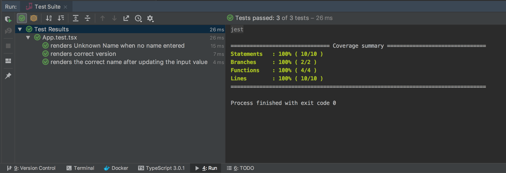
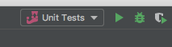

There is very little documentation on setting up a TypeScript React project that is not using the `create-react-app` magical nonsense.

The [Create React App]([GitHub - facebook/create-react-app: Create React apps with no build configuration.](https://github.com/facebook/create-react-app)) helper works great for greenfield projects, or projects that are not going to deviate at all from the structure and tools the Create React App helper gives you.



My goal is to give you a fairly slim (while remaining production ready) tested, TypeScript React app, WITH code coverage.

### Microsoft Typescript React Starter

Microsoft has a pretty great [TypeScript + React Starter](https://github.com/Microsoft/Typescript-React-Starter), but again it is using Create React App under the hood.

My repository is different than the Microsoft TypeScript + React Starter in two major ways.

- We do NOT use Create React App
- We do NOT include Redux in our starter.

If you want to add redux into, go for it.  Redux is out of the scope of what I am trying to demonstrate here.

### Testing With Jest + TypeScript

Setting up Jest with TypeScript is pretty easy. The first thing you are going to need to do is install jest, ts-jest as well as the typing definitions.

```bash
npm install --save-dev jest ts-jest @types/jest
```

By default, jest is configured to listen to only JavaScript files, since we are using TypeScript, we are going to have to update Jest to test our TypeScript  files as well.

This configuration is done in our  `jest.config.js` file in our project root.

```json
    "transform": {
      "^.+\\.tsx?$": "ts-jest"
    },
    "testRegex": "(/__tests__/.*|(\\.|/)(test|spec))\\.(jsx?|tsx?)$",
    "moduleFileExtensions": [
      "ts",
      "tsx",
      "js",
      "jsx",
      "json",
      "node"
    ]
```

### Configure Enzyme with Jest

Now that Jest is configured for TypeScript, we need to configure an Enzyme Adapter inside our jest configuration.

[Enzyme](https://github.com/airbnb/enzyme) is a JavaScript Testing utility for React built by AirBnB. It makes it easy to test React Components by mimicking jQuery’s API for DOM manipulation and traversing.

```bash
npm install --save-dev enzyme enzyme-adapter-react-16
```

If you try and run the test before adding the Enzyme Adaptor, you are going to be met with the following message:

```bash
          Enzyme Internal Error: Enzyme expects an adapter to be configured, but found none.
          To configure an adapter, you should call `Enzyme.configure({ adapter: new Adapter() })`
          before using any of Enzyme's top level APIs, where `Adapter` is the adapter
          corresponding to the library currently being tested. For example:

          import Adapter from 'enzyme-adapter-react-15ind
ex.md
renders the correct name after updating the input value', () => {
    > 16 |   const app = enzyme.shallow(<App version={1.1}/>);
         |                      ^
      17 |   app.find('input').simulate('change', { target: { value: 'Jason Raimondi' } });
      18 |   expect(app.find('.your-name').text()).toEqual('Your Name: Jason Raimondi');
      19 | });
```

To resolve this, we are going to need to add a `setupTests.ts` file that will register our Enzyme Adapter. We are going to add this file at

```javascript
import * as enzyme from 'enzyme';
import * as Adapter from 'enzyme-adapter-react-16';

enzyme.configure({ adapter: new Adapter() });
```

Now we are going to need to register this new setup file with by adding the following “setupFiles” to our `jest.config.js` . DO NOT change `<rootDir>`.

```json
  "setupFiles": [
    "<rootDir>/test/setupTests.ts"
  ]
```

### Resolve Static Asset Imports in React Components

We are going to need to add a couple of mock import files that will resolve whenever static assets are imported into our components. This allows you to import assets such as pre compiled style sheets, images, videos, and more. Basically, anything that `file-loader` would be resolving for us during the actual Webpack build.

Create the following two files:

```javascript
export default 'test-file-stub';
```

```javascript
export default {};
```

Now you are going to nee do edit our `jest.config.js`, this time adding a moduleNameMapper section that will allow Jest to resolve imports from static assets and files.

```json
  "moduleNameMapper": {
    "\\.(jpg|jpeg|png|gif|eot|otf|webp|svg|ttf|woff|woff2|mp4|webm|wav|mp3|m4a|aac|oga)$": "<rootDir>/test/fileMock.ts",
    "\\.(css|pcss)$": "<rootDir>/test/styleMock.ts"
  }
```

### Running the Tests

You can manually run the tests with the `npm run test` command.

```bash
$ npm run test

> @jmondi/typescript-react-starter@ test /Users/jraimondi/Code/typescript-react-starter
> jest

 PASS  src/app/App.test.tsx
  ✓ renders Unknown Name when no name entered (14ms)
  ✓ renders correct version (1ms)
  ✓ renders the correct name after updating the input value (6ms)

Test Suites: 1 passed, 1 total
Tests:       3 passed, 3 total
Snapshots:   0 total
Time:        1.59s, estimated 2s
Ran all test suites.
```

If you are using an IntelliJ IDE (PHPStorm, WebStorm, etc), I’ve already gone and added a Jest Runner called  “Unit Test” that you can either manually trigger, or use the convenient `ctrl + r`  running that IntelliJ offers.



The github repository for this post can be found here: [jasonraimondi/typescript-react-starter](https://github.com/jasonraimondi/typescript-react-starter)
