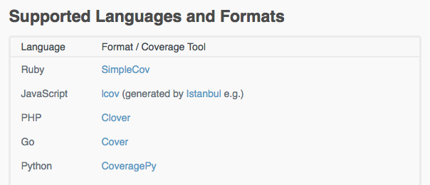

[](https://codeclimate.com/github/jasonraimondi/traverse/test_coverage)
[](https://codeclimate.com/github/jasonraimondi/traverse/maintainability)



The other day I was trying to figure out how to use [Code Climate](https://codeclimate.com/) to generate Code Coverage for a Electron/React app I am building in TypeScript. I've used Code Climate in the past for generating code coverage with PHP projects with success and remember it being really easy to set up.

On the Code Climate documentation, all that it says for JavaScript is.. [lcov](http://ltp.sourceforge.net/coverage/lcov.php) (generated by [Istanbul](http://gotwarlost.github.io/istanbul/).



After spending about an hour with lackluster documentation for JavaScript applications, I was finally able to piece together a few different sources to get it working.

### Using JEST to Generate `lcov`

Add the following to either `jest.config.js` or the `"jest"` section of your `package.json`.

```json
{
  "collectCoverage": true,
  "coverageReporters": ["lcov"],
}
```

If you want to direct coverage to a specific folder, you can go ahead and add something like the following

```json
{
  "collectCoverageFrom": ["src/**/*.{js,jsx,ts,tsx}"],
}
```

### Add Repository to Code Climate

When I got to the website, I was actually super confused. Not a huge fan of the confusing double logins, the one we are looking for is called *Quality*. You are able to use Code Climate for free on open source repositories. Private repositories are paid.



Add the repository and generate a Token for Code Coverage. You are going to need to use the token in the next part as `CC_TEST_REPORTER_ID`.



### Configure Travis CI

Inside of Travis, you are going to need to add the following environment. I ended up keeping the environment secret, I'm not sure if that is required, but I err on the side of caution.



```bash
CC_TEST_REPORTER_ID=your-id-here
```

Install and run the Code Climate test reporter with Travis CI.

```yaml
language: node_js
node_js:
- "10"
cache:
  directories:
  - node_modules
install:
- npm install -q --no-color --no-progress
before_script:
- curl -L https://codeclimate.com/downloads/test-reporter/test-reporter-latest-linux-amd64 > ./cc-test-reporter
- chmod +x ./cc-test-reporter
- ./cc-test-reporter before-build
script:
- npm run test
after_script:
- ./cc-test-reporter after-build --exit-code $TRAVIS_TEST_RESULT
```

You are going to need to trigger a build or two to get everything going, running in Travis CI and uploading properly to Code Climate.

### Add Badges to the Project README.md

The whole point of this was for the badges, so go and add your badges.



Example Repository: [https://github.com/jasonraimondi/traverse](https://github.com/jasonraimondi/traverse)

Sources:
- [https://github.com/codeclimate/test-reporter/issues/341](https://github.com/codeclimate/test-reporter/issues/341)
- [https://docs.codeclimate.com/docs/configuring-test-coverage](https://docs.codeclimate.com/docs/configuring-test-coverage)
- [https://docs.codeclimate.com/docs/travis-ci-test-coverage](https://docs.codeclimate.com/docs/travis-ci-test-coverage)
- [https://jestjs.io/docs/en/configuration.html](https://jestjs.io/docs/en/configuration.html#coveragereporters-array-string)
